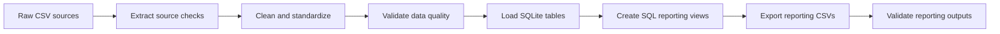
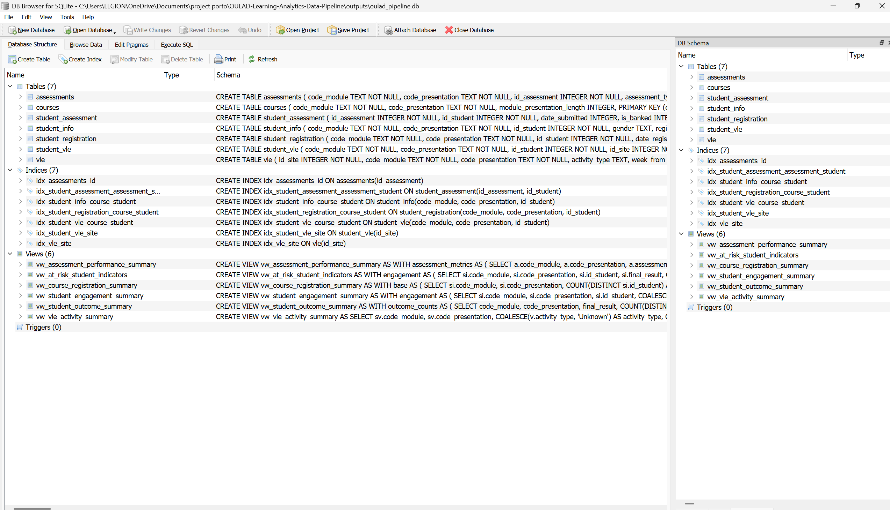

# OULAD Learning Analytics Data Pipeline

Data engineering portfolio project that transforms raw Open University Learning Analytics Dataset (OULAD) files into validated, SQL-modeled reporting outputs.

I built this project to practice the work that happens before analysis or dashboarding: checking source files, cleaning data, validating relationships, loading a local analytical database, creating SQL views, and exporting tables that can be used by analysts.

## Project Snapshot

| Area | Result |
|---|---:|
| Raw source files | 7 |
| Largest source table | `studentVle.csv` |
| `studentVle` rows processed | 10,655,280 |
| Chunk size used for large file processing | 100,000 rows |
| Student-course records | 32,593 |
| Reporting tables exported | 6 |
| Blocking validation issues | 0 |
| Reporting output quality check | Passed |

## Dataset and Large Files

This repository does not include the raw OULAD CSV files or the generated SQLite database file.

That is intentional:

- the raw dataset should be downloaded from the official OULAD source
- `studentVle.csv` is large and is processed locally in chunks
- `outputs/oulad_pipeline.db` is generated by the pipeline and can be recreated
- the repo keeps the code, SQL, documentation, validation summaries, reporting outputs, and database preview image for review

Official dataset link:

```text
https://analyse.kmi.open.ac.uk/open-dataset
```

After downloading the dataset, place the seven CSV files in `data/raw/` and run the steps in `RUNNING.md`.

## Business Context

Online learning teams need reliable data to monitor course registration, engagement, assessment performance, withdrawals, and student outcomes.

The raw OULAD files are split across multiple source tables and are not immediately ready for reporting. They contain relationship dependencies, relative date fields, missing values, large clickstream activity, and categorical fields that need validation before analysts can trust the outputs.

## Pipeline Flow



## SQLite Database Evidence

Local SQLite database generated by the pipeline:

| Database object | Count |
|---|---:|
| Core tables | 7 |
| Indexes | 7 |
| Reporting views | 6 |
| Foreign key violations | 0 |

Core table row counts:

| Table | Rows |
|---|---:|
| `courses` | 22 |
| `assessments` | 206 |
| `student_assessment` | 173,912 |
| `student_info` | 32,593 |
| `student_registration` | 32,593 |
| `student_vle` | 10,655,280 |
| `vle` | 6,364 |

Raw source CSV files and generated database files are excluded from Git because they can be recreated from the official OULAD dataset.

## SQLite Database Preview

<a href="assets/sqlite_database_preview.png">
  
</a>

[Open the full-resolution database preview](assets/sqlite_database_preview.png).

## What The Pipeline Produces

| Output table | Purpose |
|---|---|
| `course_registration_summary.csv` | Course-level registration, withdrawal, pass, fail, and distinction metrics. |
| `student_engagement_summary.csv` | Student-level click, active-day, site-visit, and engagement bucket metrics. |
| `assessment_performance_summary.csv` | Assessment score, missing score, late submission, and submission-rate metrics. |
| `vle_activity_summary.csv` | Learning platform activity summary by activity type. |
| `student_outcome_summary.csv` | Final outcome distribution by course presentation. |
| `at_risk_student_indicators.csv` | Rule-based review indicators for low engagement, low score, or missing assessment activity. |

The at-risk indicator is a reporting rule, not a predictive machine learning model.

## Sample Outputs

These are small excerpts from the exported CSV files in `outputs/reporting_tables/`.

### Course Registration Summary

| code_module | code_presentation | total_students | withdrawal_rate | pass_rate |
|---|---|---:|---:|---:|
| AAA | 2013J | 383 | 15.7% | 72.6% |
| AAA | 2014J | 365 | 18.1% | 69.3% |
| BBB | 2013B | 1,767 | 28.6% | 45.4% |

### Student Engagement Summary

| code_module | code_presentation | id_student | total_clicks | active_days | engagement_bucket |
|---|---|---:|---:|---:|---|
| AAA | 2013J | 11391 | 934 | 40 | Low |
| AAA | 2013J | 28400 | 1,435 | 80 | Medium |
| AAA | 2013J | 30268 | 281 | 12 | Low |

### Assessment Performance Summary

| code_module | code_presentation | assessment_type | submission_count | avg_score | late_submission_rate |
|---|---|---|---:|---:|---:|
| AAA | 2013J | TMA | 1,633 | 69.4 | 23.6% |
| AAA | 2014J | TMA | 1,516 | 68.6 | 28.3% |
| BBB | 2013B | CMA | 5,049 | 88.3 | 99.6% |

## Data Quality Coverage

The validation layer checks:

- required source files
- missing critical identifiers
- duplicate business keys
- cross-table relationship consistency
- SQLite primary key and foreign key integrity
- assessment scores outside `0` to `100`
- negative VLE click values
- invalid `final_result` categories
- invalid `assessment_type` categories
- missing registration dates
- missing `imd_band`
- missing assessment scores

Documented validation result:

```text
Blocking validation issues: 0
Reporting output quality gate: passed
```

Proof files:

```text
documentation/pipeline_run_summary.md
documentation/validation_summary.md
documentation/reporting_output_quality_summary.md
```

## Repository Structure

```text
OULAD-Learning-Analytics-Data-Pipeline/
|-- README.md
|-- RUNNING.md
|-- VERIFY_PROJECT.md
|-- project_brief.md
|-- requirements.txt
|-- .github/
|-- case-study/
|-- data/
|   |-- raw/
|   `-- processed/
|-- documentation/
|-- outputs/
|   `-- reporting_tables/
|-- scripts/
|-- sql/
|-- dashboard/
`-- assets/
```

## Files Worth Reviewing

| File | Why it matters |
|---|---|
| `scripts/run_pipeline.py` | Runs the ETL workflow in order. |
| `scripts/02_clean_transform.py` | Handles cleaning, type conversion, and chunk processing. |
| `scripts/03_validate_data.py` | Performs source and relationship validation. |
| `scripts/04_load_to_sqlite.py` | Loads cleaned data into SQLite and checks foreign key integrity. |
| `scripts/05_export_reporting_tables.py` | Creates reporting views and exports CSV outputs. |
| `scripts/07_validate_reporting_outputs.py` | Validates exported reporting tables. |
| `scripts/verify_project.py` | Performs lightweight package checks for GitHub review. |
| `sql/create_tables.sql` | Defines SQLite tables with primary keys, foreign keys, and checks. |
| `sql/reporting_views.sql` | Defines the SQL reporting layer. |
| `.github/workflows/validate-reporting-outputs.yml` | Standalone GitHub Actions workflow for this project if it is used as its own repository. |
| `case-study/OULAD_Learning_Analytics_Data_Pipeline_Case_Study.md` | Full project case study. |

## Reproducibility

Raw OULAD CSV files are not included in this repository because of size and dataset ownership. The documented run summaries and exported reporting tables are included for review.

Quick verification and local reproduction steps are available in:

```text
VERIFY_PROJECT.md
RUNNING.md
```

## Scope

This is a local, reproducible data engineering portfolio project. It does not claim production deployment, private data access, live dashboard hosting, or predictive modeling.

The focus is reliable ingestion, transformation, validation, SQL modeling, reporting outputs, and clear documentation.
