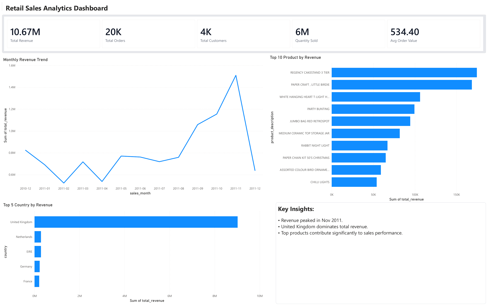
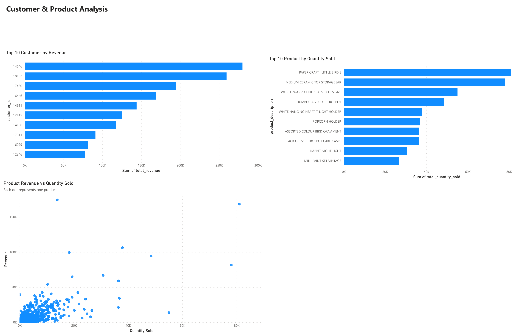
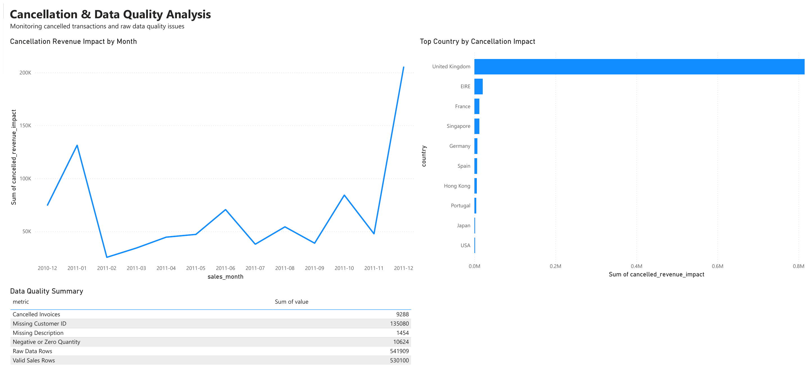

# Retail Sales & Operations Analytics

A portfolio case study that turns raw retail transaction data into SQL reporting views and a three-page Power BI dashboard.

This project focuses on sales performance, product and customer behavior, country-level revenue, cancellation impact, and raw data quality.

## Project Summary

The project starts from the UCI Online Retail dataset and follows a realistic analytics workflow:

Raw CSV file  
SQL Server raw table  
Data quality checks  
SQL cleaning views  
SQL analysis views  
Power BI dashboard  
Business findings and recommendations

The goal is not only to create a dashboard, but to make the reporting logic explainable and reliable before the data reaches Power BI.

## Tools Used

SQL Server  
SQL Server Management Studio  
Power BI  
Excel or CSV for raw data preparation

## Dashboard Pages

### Executive Overview

A high-level summary of revenue, orders, customers, quantity sold, average order value, monthly revenue trend, top products, top countries, and key insights.

### Customer & Product Analysis

A focused view of high-value customers, top products by quantity sold, and the relationship between product quantity and revenue.

### Cancellation & Data Quality

A monitoring page for cancellation impact and raw data quality issues.

## Key Data Quality Findings

Raw data rows: 541,909  
Missing Customer ID: 135,080  
Missing Description: 1,454  
Negative or zero quantity: 10,624  
Cancelled invoices: 9,288  
Valid sales rows: 530,100

These checks were used to separate valid sales reporting from cancelled, invalid, or incomplete records.

## SQL Workflow

The SQL layer was designed to keep the logic clear and reusable.

Main views created:

`vw_retail_clean`  
Cleans raw fields, converts dates and prices, calculates revenue, and flags cancelled invoices.

`vw_retail_valid_sales`  
Filters records used for the main dashboard.

`vw_executive_kpi`  
Prepares KPI metrics for the Executive Overview page.

`vw_monthly_sales`  
Summarizes revenue, orders, and quantity sold by month.

`vw_product_performance_clean`  
Analyzes product performance while excluding postage, manual charges, discounts, and service-related records.

`vw_customer_performance`  
Summarizes customer-level revenue, order count, and quantity purchased.

`vw_country_performance`  
Summarizes revenue, orders, customers, quantity sold, and average order value by country.

`vw_cancellation_analysis`  
Measures cancellation impact by month and country.

`vw_data_quality_summary`  
Summarizes key data quality issues for reporting transparency.

## Main Files

`case-study/Retail_Sales_Operations_Analytics_Case_Study.pdf`  
Final case study document for reading or sharing.

`case-study/Retail_Sales_Operations_Analytics_Case_Study.docx`  
Editable version of the case study.

`dashboard/powerbi/Retail_Sales_Operations_Analytics.pbix`  
Power BI dashboard file.

`sql/`  
SQL scripts for data quality checks, cleaning views, analysis views, and validation queries.

`documentation/`  
Metric definitions, workflow notes, assumptions, and limitations.

`dashboard/screenshots/`  
Clean screenshots of the three dashboard pages extracted from the exported dashboard PDF.

`dashboard/exported_pdf/Retail_Sales_Analytics_Dashboard.pdf`  
Clean exported dashboard PDF used as the screenshot source.

## How to Reproduce

1. Download the UCI Online Retail dataset.
2. Save the dataset as CSV if needed.
3. Import the CSV into SQL Server as `dbo.Online_Retail_Raw`.
4. Run the SQL scripts in this order:
   1. `00_create_database_and_raw_table.sql`
   2. `01_data_quality_check.sql`
   3. `02_data_cleaning_views.sql`
   4. `03_analysis_views.sql`
   5. `04_validation_queries.sql`
5. Connect Power BI to the reporting views.
6. Build or review the dashboard pages.

## Note

The Power BI `.pbix` file is included in `dashboard/powerbi/`. If the dashboard layout is updated later, replace the file with the latest version using the same filename.
