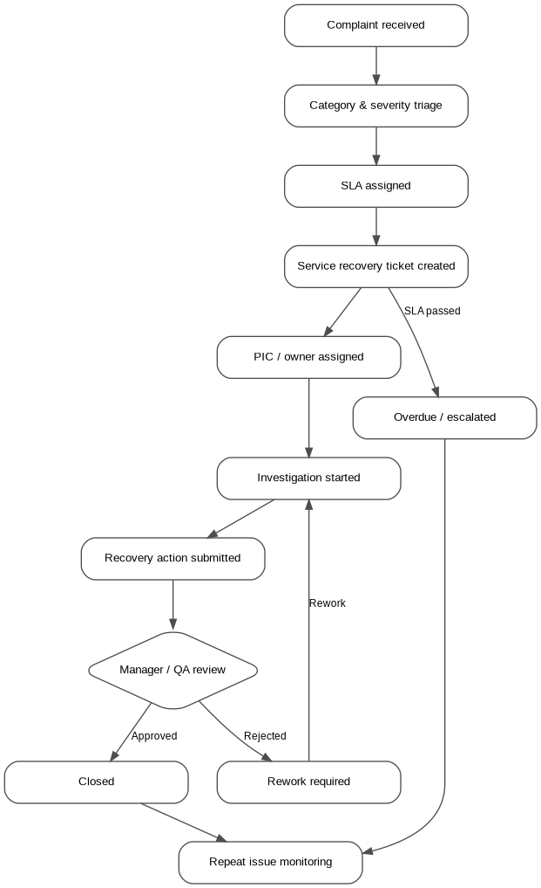
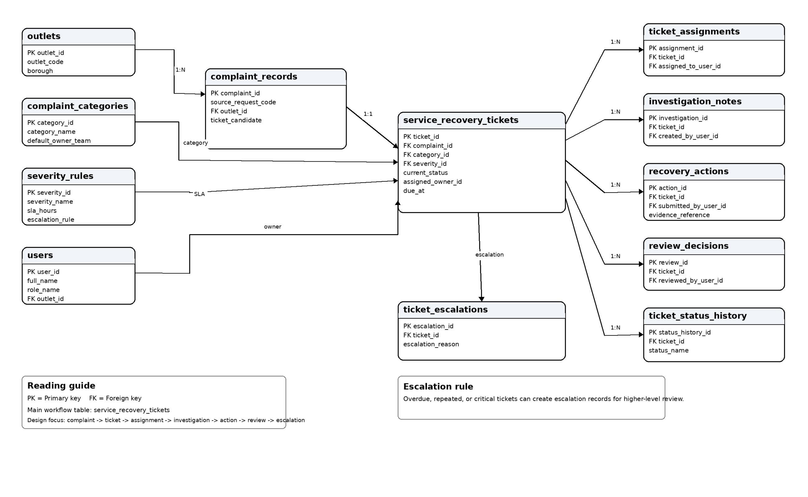
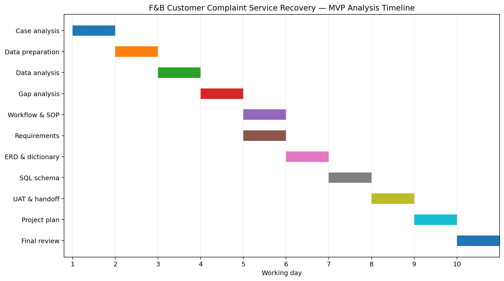

# F&B Customer Complaint & Service Recovery Management System

A System Analyst case study that uses public complaint data references to design a service recovery workflow for multi-outlet F&B operations.

The project focuses on one workflow:

> Customer complaint → triage → severity & SLA → service recovery ticket → assignment → investigation → recovery action → review → closure/rework → repeat issue monitoring

## Why this project exists

Customer complaints are not only feedback. In a multi-outlet F&B business, they can signal service gaps, hygiene issues, food safety concerns, inconsistent outlet handling, or repeated operational problems.

Public complaint data structures, such as NYC 311 service requests, show how complaints can be recorded with complaint type, status, due date, resolution description, location type, and submission channel. This project uses that structure as a realistic reference to design an internal complaint handling and service recovery system.

## Main workflow

## Data model

## Project timeline

## Main sources

- NYC Open Data — 311 Service Requests from 2020 to Present  
  https://data.cityofnewyork.us/Social-Services/311-Service-Requests-from-2020-to-Present/erm2-nwe9

- NYC311 — Food Safety Complaint  
  https://portal.311.nyc.gov/article/?kanumber=KA-01111

- ISO 10002:2018 — Guidelines for complaints handling in organizations  
  https://www.iso.org/standard/71580.html

## Project files

| File | Purpose |
|---|---|
| `docs/case-brief-and-sources.md` | Business case, source justification, scope, assumptions, and expected outcome |
| `docs/data-exploration-summary.md` | Initial complaint data summary and system design implications |
| `docs/gap-analysis.md` | Current condition, business pain, system need, and MVP priority gaps |
| `docs/workflow-sop-requirements.md` | Target workflow, SOP, user stories, requirements, business rules, and SLA logic |
| `docs/erd-business-rules-data-dictionary.md` | ERD, main relationships, data dictionary, business rules, and monitoring support |
| `docs/uat-traceability-developer-handoff.md` | Acceptance criteria, UAT scenarios, traceability matrix, API outline, validation rules, and developer handoff notes |
| `docs/project-plan-timeline.md` | Work breakdown, MVP backlog, risk controls, and delivery timeline |
| `data/README.md` | Data source, privacy handling, and rebuild notes |
| `data/sample-311-food-complaints.csv` | Clean anonymized/generalized working sample |
| `sql/README.md` | SQL run order and usage notes |
| `sql/create-staging-table.sql` | SQL Server-style staging table for sample data |
| `sql/load-sample-data.sql` | Optional insert script for the included working sample |
| `sql/analysis-queries.sql` | Analysis queries for category, SLA, severity, owner routing, and monitoring signals |
| `sql/service-recovery-schema.sql` | SQL Server-style schema for the internal service recovery workflow tables |
| `project-timeline-gantt.xlsx` | Gantt-style workbook with timeline, backlog, risks, and source references |
| `assets/service-recovery-workflow.png` | Visual workflow preview |
| `assets/service-recovery-erd.png` | Visual ERD preview |
| `assets/project-timeline.png` | Visual timeline preview |
| `assets/pdf/service-recovery-workflow.pdf` | PDF workflow preview |
| `assets/pdf/service-recovery-erd.pdf` | PDF ERD preview |
| `assets/pdf/project-timeline.pdf` | PDF timeline preview |
| `assets/editable-source/service-recovery-workflow.drawio` | Editable workflow source for diagrams.net |
| `assets/editable-source/service-recovery-erd.drawio` | Editable ERD source for diagrams.net |
| `assets/editable-source/service-recovery-workflow.mmd` | Mermaid workflow source for documentation |
| `assets/editable-source/service-recovery-erd.dbml` | DBML source for dbdiagram.io-style modelling |

## Tools used

- SQL Server-style SQL for staging, analysis, and schema design
- Markdown for documentation
- Draw.io / diagrams.net for workflow and ERD source diagrams
- Excel-style workbook for project planning and backlog structure
- Public open data references for case grounding

## What this project is not

This is not an internal project of any specific company. It is a source-backed System Analyst case study.

It does not build a full CRM, POS, refund engine, social listening platform, chatbot, or production application.
