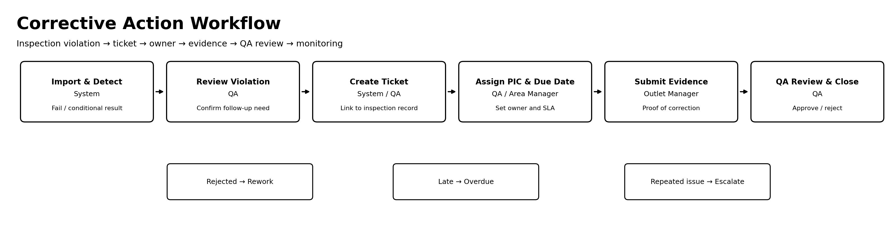
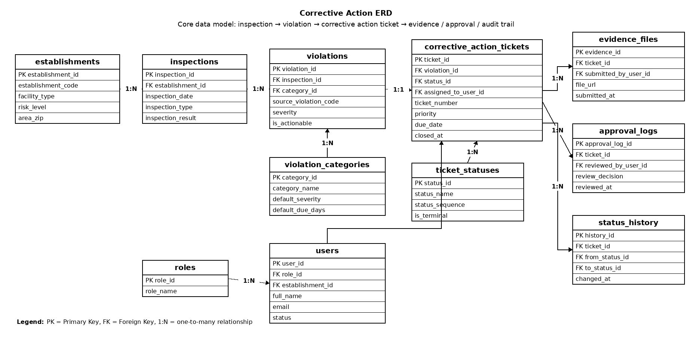

# Restaurant Inspection Corrective Action Management System

A practical system analysis project that turns public restaurant inspection findings into a corrective action workflow.

When an inspection result shows a problem, the business needs more than a record. It needs a way to assign ownership, set a due date, collect evidence, review the correction, and monitor unresolved or repeated issues.



## Project Focus

```text
Inspection finding → Corrective action ticket → Person in Charge (PIC) assignment → Due date → Evidence → QA review → Closure / Rework → Monitoring
```

The project uses official public food inspection data as a reference dataset. The local sample is anonymized and does not include business names or street addresses.

## Data and References

| Source | How it is used |
|---|---|
| City of Chicago Food Inspections Dataset | Main public dataset for inspection records, risk level, inspection result, inspection type, and violation notes. |
| NYC Health Restaurant Grades | Business context for restaurant inspection, violation scoring, and grading. |
| FDA Inspections to Protect the Food Supply | Process context for inspection, compliance follow-up, and corrective action verification. |

Source links:

- City of Chicago Food Inspections Dataset: https://data.cityofchicago.org/Health-Human-Services/Food-Inspections/4ijn-s7e5
- NYC Health Restaurant Grades: https://www.nyc.gov/site/doh/services/restaurant-grades.page
- FDA Inspections to Protect the Food Supply: https://www.fda.gov/food/compliance-enforcement-food/inspections-protect-food-supply

## What I Designed

The proposed system helps an F&B operator manage inspection follow-up in a structured way:

1. Import inspection records.
2. Detect failed or conditional inspection results.
3. Review violation notes.
4. Create corrective action tickets.
5. Assign a Person in Charge (PIC) and due date.
6. Allow outlet users to submit evidence.
7. Let QA approve or reject the correction.
8. Monitor open, overdue, closed, rework, and repeated issues.

## Main Deliverables

| Document | Purpose |
|---|---|
| [`case-brief-and-sources.md`](docs/case-brief-and-sources.md) | Case background, source justification, scope, assumptions, and expected outcome. |
| [`data-exploration-summary.md`](docs/data-exploration-summary.md) | Data findings that support the need for a corrective action workflow. |
| [`gap-analysis.md`](docs/gap-analysis.md) | Current condition, pain point, business risk, and system need. |
| [`workflow-sop-requirements.md`](docs/workflow-sop-requirements.md) | To-Be workflow, SOP, user stories, functional requirements, and NFR. |
| [`erd-business-rules-data-dictionary.md`](docs/erd-business-rules-data-dictionary.md) | ERD, data dictionary, relationships, and business rules. |
| [`uat-traceability-developer-handoff.md`](docs/uat-traceability-developer-handoff.md) | Acceptance criteria, UAT scenarios, traceability matrix, validation rules, and API discussion points. |
| [`project-plan-timeline.md`](docs/project-plan-timeline.md) | MVP analysis timeline, backlog direction, risks, and developer coordination notes. |

## ERD Preview

The data model connects inspection records with violations, corrective action tickets, evidence, approval logs, and status history.



Diagram PDFs are available in `assets/pdf/`. Editable source files are kept separately in `assets/editable-source/`.

## Repository Structure

```text
restaurant-inspection-corrective-action-system/
│
├── README.md
├── docs/
│   ├── case-brief-and-sources.md
│   ├── data-exploration-summary.md
│   ├── gap-analysis.md
│   ├── workflow-sop-requirements.md
│   ├── erd-business-rules-data-dictionary.md
│   ├── uat-traceability-developer-handoff.md
│   └── project-plan-timeline.md
│
├── data/
│   ├── README.md
│   └── sample-food-inspections.csv
│
├── sql/
│   ├── create-staging-table.sql
│   ├── analysis-queries.sql
│   └── corrective-action-schema.sql
│
├── assets/
│   ├── workflow-diagram.png
│   ├── erd.png
│   ├── project-timeline.png
│   ├── pdf/
│   │   ├── workflow-diagram.pdf
│   │   ├── erd.pdf
│   │   └── project-timeline.pdf
│   └── editable-source/
│       ├── workflow-diagram.drawio
│       ├── workflow-diagram.mmd
│       ├── erd.drawio
│       └── erd.dbml
│
└── project-timeline-gantt.xlsx
```

## Tools Used

| Area | Tools |
|---|---|
| Documentation | Markdown, GitHub |
| Workflow modelling | Draw.io / diagrams.net, Mermaid |
| ERD and data modelling | Draw.io, DBML, SQL |
| Data exploration | CSV, SQL |
| Project planning | Excel-style Gantt timeline |

## Scope Boundary

This project stays focused on corrective action workflow. It does not build a POS system, inventory system, purchasing system, ERP, machine learning model, or production application.

The goal is to show clear System Analyst work: source data, business gap, workflow, requirements, ERD, UAT, and developer handoff.
