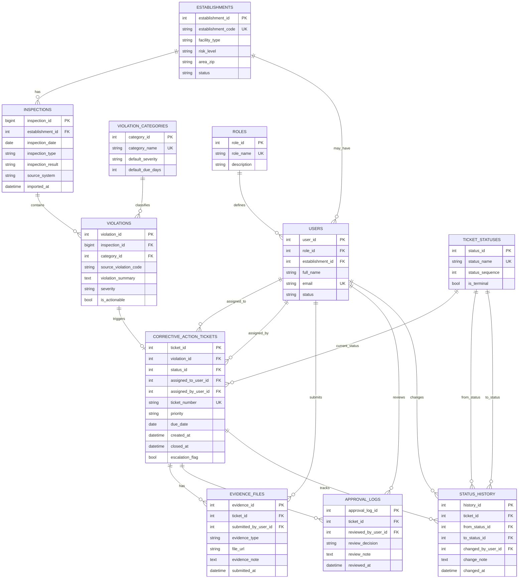

# ERD, Business Rules, and Data Dictionary

## Purpose

This document defines the logical data model for the **Restaurant Inspection Corrective Action Management System**.

The model supports one MVP workflow:

```text
inspection finding → corrective action ticket → Person in Charge (PIC) assignment → due date → evidence → QA review → closure / rework → monitoring
```

The ERD is intentionally focused and does not model POS, inventory, purchasing, or full ERP operations.

## Data Model Principles

| Principle | Meaning |
|---|---|
| Separate source data and workflow data | Inspection records come from public data; tickets, evidence, approvals, and status history are internal workflow data. |
| Keep traceability | Every ticket must link back to a violation and inspection record. |
| Make closure auditable | A ticket cannot be closed without evidence and QA review. |
| Support monitoring | Open, overdue, closed, rejected, and repeated issues must be easy to query. |
| Keep sample data safe | Local sample data uses anonymized establishment codes instead of business names. |

## ERD Preview


Diagram sources:

- `../assets/editable-source/erd.drawio`
- `../assets/editable-source/erd.dbml`
- `../assets/pdf/erd.pdf`

Proposed SQL schema:

- `../sql/corrective-action-schema.sql`

## Entity Groups

| Group | Tables | Purpose |
|---|---|---|
| Source data layer | `establishments`, `inspections`, `violation_categories`, `violations` | Stores inspection records and violation details. |
| Workflow layer | `corrective_action_tickets`, `ticket_statuses`, `evidence_files`, `approval_logs`, `status_history` | Manages corrective action lifecycle. |
| Access layer | `users`, `roles` | Defines actors, ownership, and permissions. |

## Key Relationships

| Relationship | Meaning |
|---|---|
| One establishment has many inspections | One outlet or food establishment can be inspected multiple times. |
| One inspection has many violations | One inspection record can contain multiple findings. |
| One violation category classifies many violations | Category supports priority, reporting, and repeat issue monitoring. |
| One violation can trigger one corrective action ticket in the MVP | One actionable finding becomes one ticket. |
| One ticket has one current status | Current status is stored in `corrective_action_tickets.status_id`. |
| One ticket can have many evidence files | Outlet users may upload multiple proof files. |
| One ticket can have many approval logs | QA may approve, reject, or request rework more than once. |
| One ticket can have many status history records | Status movement is stored for audit trail. |
| One role can have many users | Supports role-based access. |

## Mermaid ERD



## Data Dictionary

### `establishments`

Stores anonymized outlet or food establishment identity.

| Field | Type | Key | Notes |
|---|---|---|---|
| `establishment_id` | INT | PK | Internal surrogate key. |
| `establishment_code` | VARCHAR(50) | Unique | Anonymized outlet code, example: `EST-001`. |
| `facility_type` | VARCHAR(150) |  | Restaurant, grocery, bakery, catering, etc. |
| `risk_level` | VARCHAR(100) |  | Risk level from inspection data. |
| `area_zip` | VARCHAR(20) |  | General location grouping. |
| `status` | VARCHAR(30) |  | Active/inactive status. |

### `inspections`

Stores inspection event records.

| Field | Type | Key | Notes |
|---|---|---|---|
| `inspection_id` | BIGINT | PK | Source inspection ID. |
| `establishment_id` | INT | FK | Links to `establishments`. |
| `inspection_date` | DATE |  | Date of inspection. |
| `inspection_type` | VARCHAR(255) |  | Canvass, complaint, re-inspection, license, etc. |
| `inspection_result` | VARCHAR(100) |  | Pass, Fail, Pass w/ Conditions, etc. |
| `source_system` | VARCHAR(150) |  | Source dataset name. |
| `imported_at` | DATETIME |  | Data import timestamp. |

### `violation_categories`

Stores simplified classification for violation monitoring.

| Field | Type | Key | Notes |
|---|---|---|---|
| `category_id` | INT | PK | Category key. |
| `category_name` | VARCHAR(150) | Unique | Example: pest control, handwashing, sanitation, certification. |
| `default_severity` | VARCHAR(50) |  | High, Medium, Low, Manual Review. |
| `default_due_days` | INT |  | Default SLA days for the category. |

### `violations`

Stores violation details linked to an inspection.

| Field | Type | Key | Notes |
|---|---|---|---|
| `violation_id` | INT | PK | Internal violation key. |
| `inspection_id` | BIGINT | FK | Links to `inspections`. |
| `category_id` | INT | FK nullable | Links to `violation_categories`. |
| `source_violation_code` | VARCHAR(50) |  | Source violation code when available. |
| `violation_summary` | VARCHAR(MAX) |  | Cleaned violation note. |
| `severity` | VARCHAR(50) |  | Final severity after QA review. |
| `is_actionable` | BIT |  | Whether ticket creation is required. |

### `roles`

Stores user role definitions.

| Field | Type | Key | Notes |
|---|---|---|---|
| `role_id` | INT | PK | Role key. |
| `role_name` | VARCHAR(100) | Unique | QA, Outlet Manager, Area Manager, Management, Admin. |
| `description` | VARCHAR(255) |  | Short role description. |

### `users`

Stores users involved in the corrective action workflow.

| Field | Type | Key | Notes |
|---|---|---|---|
| `user_id` | INT | PK | User key. |
| `role_id` | INT | FK | Links to `roles`. |
| `establishment_id` | INT | FK nullable | Required for outlet users; optional for HQ users. |
| `full_name` | VARCHAR(150) |  | User name. |
| `email` | VARCHAR(255) | Unique | User email. |
| `status` | VARCHAR(30) |  | Active/inactive status. |

### `ticket_statuses`

Stores allowed ticket statuses.

| Field | Type | Key | Notes |
|---|---|---|---|
| `status_id` | INT | PK | Status key. |
| `status_name` | VARCHAR(50) | Unique | Open, Assigned, In Progress, Pending Review, Rework, Overdue, Closed. |
| `status_sequence` | INT |  | Workflow order. |
| `is_terminal` | BIT |  | True when status is final. |

### `corrective_action_tickets`

Stores the main corrective action workflow object.

| Field | Type | Key | Notes |
|---|---|---|---|
| `ticket_id` | INT | PK | Ticket key. |
| `violation_id` | INT | FK / Unique | Links to one violation; unique to reduce duplicate ticket risk. |
| `status_id` | INT | FK | Current ticket status. |
| `assigned_to_user_id` | INT | FK nullable | PIC responsible for correction. |
| `assigned_by_user_id` | INT | FK nullable | QA or manager who assigned the ticket. |
| `ticket_number` | VARCHAR(50) | Unique | Human-readable ticket ID. |
| `priority` | VARCHAR(50) |  | High, Medium, Low, Manual Review. |
| `due_date` | DATE |  | Correction deadline. |
| `created_at` | DATETIME |  | Ticket creation date. |
| `closed_at` | DATETIME nullable |  | Closure timestamp after approval. |
| `escalation_flag` | BIT |  | Marks overdue or repeated issue escalation. |

### `evidence_files`

Stores proof submitted by outlet users.

| Field | Type | Key | Notes |
|---|---|---|---|
| `evidence_id` | INT | PK | Evidence key. |
| `ticket_id` | INT | FK | Links to `corrective_action_tickets`. |
| `submitted_by_user_id` | INT | FK | User who uploaded evidence. |
| `evidence_type` | VARCHAR(50) |  | Photo, document, note, checklist, etc. |
| `file_url` | VARCHAR(500) |  | File path or storage URL. |
| `evidence_note` | VARCHAR(MAX) |  | Optional explanation. |
| `submitted_at` | DATETIME |  | Upload timestamp. |

### `approval_logs`

Stores QA review decisions.

| Field | Type | Key | Notes |
|---|---|---|---|
| `approval_log_id` | INT | PK | Approval key. |
| `ticket_id` | INT | FK | Ticket being reviewed. |
| `reviewed_by_user_id` | INT | FK | QA reviewer. |
| `review_decision` | VARCHAR(50) |  | Approved, Rejected, Rework Requested. |
| `review_note` | VARCHAR(MAX) |  | QA feedback. |
| `reviewed_at` | DATETIME |  | Review timestamp. |

### `status_history`

Stores audit trail of ticket status changes.

| Field | Type | Key | Notes |
|---|---|---|---|
| `history_id` | INT | PK | History key. |
| `ticket_id` | INT | FK | Links to `corrective_action_tickets`. |
| `from_status_id` | INT | FK nullable | Previous status. |
| `to_status_id` | INT | FK | New status. |
| `changed_by_user_id` | INT | FK nullable | User who changed status; nullable for system updates. |
| `change_note` | VARCHAR(MAX) |  | Optional note or system reason. |
| `changed_at` | DATETIME |  | Timestamp of change. |

## Key Business Rules

| ID | Rule | Data Model Impact |
|---|---|---|
| BR-01 | A failed inspection should create or propose at least one corrective action ticket. | `inspection_result` triggers ticket creation logic. |
| BR-02 | Pass w/ Conditions records require QA review before closure. | Ticket starts as `Open` or review item. |
| BR-03 | High-risk records receive higher priority and shorter due date. | `risk_level`, `priority`, and `due_date` are required. |
| BR-04 | One actionable violation should not create duplicate tickets. | `corrective_action_tickets.violation_id` should be unique in MVP. |
| BR-05 | A ticket cannot be closed without evidence. | At least one `evidence_files` record is required before closure. |
| BR-06 | QA approval is required before ticket status becomes Closed. | Closure must have an `approval_logs` record with decision = Approved. |
| BR-07 | Rejected evidence returns the ticket to Rework. | `approval_logs.review_decision = Rejected` updates ticket status. |
| BR-08 | Every ticket status change must be auditable. | Insert records into `status_history`. |
| BR-09 | Overdue status is derived when due date has passed and ticket is not Closed. | Requires `due_date` and scheduled status check. |
| BR-10 | Repeated violations by establishment and category should be flagged for escalation. | Derived from historical `violations` and `violation_categories`. |

## Monitoring Queries Supported

| Business Question | Main Tables Used |
|---|---|
| Which tickets are open? | `corrective_action_tickets`, `ticket_statuses`, `violations`, `inspections` |
| Which tickets are overdue? | `corrective_action_tickets`, `ticket_statuses`, `users`, `establishments` |
| Which outlets have repeated violations? | `establishments`, `inspections`, `violations`, `violation_categories` |
| Which tickets are waiting for QA review? | `corrective_action_tickets`, `evidence_files`, `approval_logs` |
| Which violation categories appear most often? | `violation_categories`, `violations` |

## Developer Handoff Notes

Recommended build order:

1. Create master tables: `roles`, `establishments`, `users`, `violation_categories`, `ticket_statuses`.
2. Create source-driven tables: `inspections`, `violations`.
3. Create workflow tables: `corrective_action_tickets`, `evidence_files`, `approval_logs`, `status_history`.
4. Implement business rules for ticket creation, status lifecycle, evidence requirement, and QA approval.
5. Build monitoring queries for open, overdue, closed, rework, and repeated issues.

## Scope Boundary

This data model supports only the corrective action workflow.

POS, inventory, purchasing, and ERP modules stay outside this MVP data model unless handled as separate future projects.
